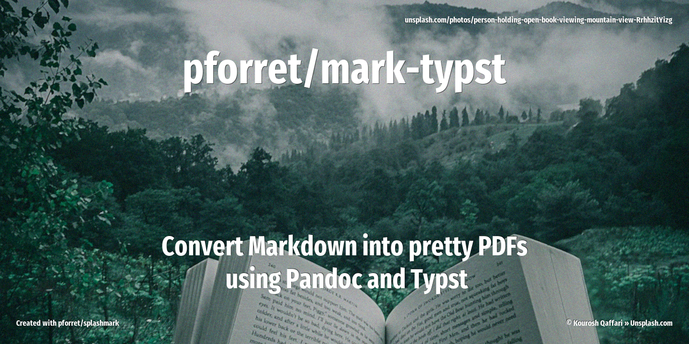

# mark-typst


**Generate beautiful PDFs from Markdown sources**, using [pandoc](https://pandoc.org) and [typst](https://typst.app).



Markdown goes in, a styled PDF comes out — fonts, logo, paper size and margins configured once in a `.env` file. Typst compiles in milliseconds, pandoc speaks every Markdown dialect: together they make beautiful PDFs.

```
doc.md ──pandoc──▶ .doc.typ ──typst──▶ doc.pdf
                      ▲
        mark-typst.template.typ + .env settings
```

## Usage

```
Program : mark-typst.sh  by peter@forret.com
Purpose : generate beautiful PDF from Markdown sources
Usage   : mark-typst.sh [-h] [-Q] [-V] [-f] [-O] [-L <LOG_DIR>] [-T <TMP_DIR>] <action> <input?> <output?>
Flags, options and parameters:
    -h|--help        : [flag] show usage [default: off]
    -Q|--QUIET       : [flag] no output [default: off]
    -V|--VERBOSE     : [flag] also show debug messages [default: off]
    -f|--FORCE       : [flag] do not ask for confirmation (always yes) [default: off]
    -O|--OPEN        : [flag] open the PDF after a successful build [default: off]
    -L|--LOG_DIR <?> : [option] folder for log files   [default: ~/log/mark-typst]
    -T|--TMP_DIR <?> : [option] folder for temp files  [default: /tmp/mark-typst]
    <action>         : [choice] action to perform  [options: init,build,check,env,update]
    <input>          : [parameter] input markdown file (optional)
    <output>         : [parameter] output PDF file (default: <input>.pdf) (optional)
```

### Getting started

```bash
# one-time setup: checks/installs pandoc & typst, creates .env + template
mark-typst init

# convert doc.md to doc.pdf (same folder)
mark-typst build doc.md

# choose the output location
mark-typst build doc.md output/doc.pdf

# build and open the result
mark-typst -O build doc.md
```

See [docs/examples/doc.md](docs/examples/doc.md) → [docs/examples/doc.pdf](docs/examples/doc.pdf) for a sample showing headings, code blocks, tables, blockquotes, math, footnotes and images.

## Configuration (.env)

`mark-typst init` creates a `.env` file next to your documents. It is loaded automatically on every run ([bashew](https://github.com/pforret/bashew) dotenv support).

| Setting        | Default                   | Purpose                                        |
|----------------|---------------------------|------------------------------------------------|
| `FONT_BODY`    | `Georgia`                 | body text font family (serif)                  |
| `FONT_HEADERS` | `Impact`                  | headings + title font family (sans-serif)      |
| `FONT_SIZE`    | `11pt`                    | base font size (needs a unit)                  |
| `LINE_SPACING` | `0.8em`                   | space between two lines (typst default: `0.65em`) |
| `PAPER_SIZE`   | `a4`                      | typst paper size (`a4`, `us-letter`, …)        |
| `MARGIN`       | `2.5cm`                   | page margin                                    |
| `LOGO`         | *(empty)*                 | absolute path to a logo image, shown top-right |
| `LOGO_WIDTH`   | `3cm`                     | logo width                                     |
| `COVER`        | *(empty)*                 | absolute path to a cover image, used full-bleed as the whole first page (min. 1240×1754 px for A4 @ 150 dpi, ideally 2480×3508 px @ 300 dpi) |
| `WATERMARK_TEXT` | *(empty)*               | diagonal text in the background of every page, e.g. `Confidential` |
| `WATERMARK_IMAGE` | *(empty)*              | absolute path to an image shown in the background of every page |
| `WATERMARK_TRANSPARENCY` | `90%`           | how transparent the watermark is (0% = opaque, 100% = invisible) |
| `FONT_PATH`    | *(empty)*                 | extra folder with `.ttf`/`.otf` font files     |
| `TEMPLATE`     | `mark-typst.template.typ` | pandoc→typst template to use                   |

### Fonts

Typst uses the **font family name** (not the file name) of any font installed on your system — check availability with `typst fonts`.

- Default fonts (Georgia, Impact) ship with macOS.
- Google Fonts via Homebrew: `brew install --cask font-nunito`
- Or drop `.ttf`/`.otf` files in a folder and point `FONT_PATH` to it, e.g. `FONT_HEADERS="Days One"` + `FONT_PATH=./ttf`

### Template

`mark-typst.template.typ` is a [pandoc template](https://pandoc.org/MANUAL.html#templates) that emits [typst](https://typst.app/docs) markup.

Every `build` keeps the document folder self-sufficient:

- no `.env` yet? one is created with default settings
- no template yet? the default template is created
- local template older than the one in the mark-typst repo? it is replaced (the previous version is kept as `mark-typst.template.typ.bak`, so local customizations are never lost silently)

The template styles:

- title (from YAML frontmatter `title:`) and headings in `FONT_HEADERS`, bold
- every `##` (H2) section starts on a new page (assumes a single `#` H1 per document)
- syntax-highlighted code blocks on a light gray panel, code at 0.85em
- blockquotes with a steel-blue accent bar, soft background and italic text
- tables with light gray borders
- optional logo in the top-right corner

Edit it freely — it is yours after `init`. Re-running `init` never overwrites existing files unless you pass `--FORCE` (which also resets `.env`).

## Markdown support

Everything pandoc understands: headings, emphasis, code blocks with syntax highlighting, tables, blockquotes, footnotes, task lists, math (`$E = mc^2$`), horizontal rules, links and images (paths relative to the `.md` file work).

```yaml
---
title: My Document        # rendered as centered title
toc: true                 # automatic table of contents ("Contents")
toc-depth: 2              # optional: heading levels to include (default 3)
---
```

## Installation

Requires bash 4+. `pandoc` and `typst` are checked (and installed on request) by `mark-typst init`.

```bash
# via basher
basher install pforret/mark-typst

# or manually
git clone https://github.com/pforret/mark-typst.git
sudo ln -s "$(pwd)/mark-typst/mark-typst.sh" /usr/local/bin/mark-typst
```

## Acknowledgements

- built with the [bashew](https://github.com/pforret/bashew) bash scripting framework
- powered by [pandoc](https://pandoc.org) and [typst](https://typst.app)
- inspired by [typst: automated report generation](https://typst.app/blog/2025/automated-generation/)

&copy; 2026 [Peter Forret](https://github.com/pforret)
